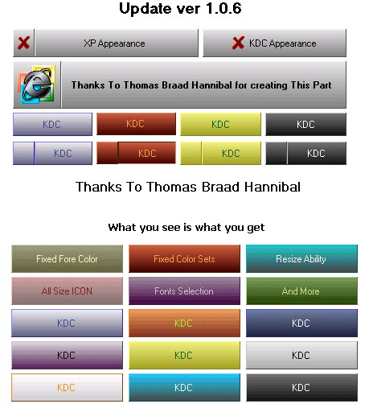



## A \- Gradient Button Update 1\.0\.8

### Description

Gradient Button with nice color sets the color sets are placed in the OCX and can be modified from the code (*Please vote for this code*),

New XP Appearance,

also you can add icon to the button ,and all the min property the color part is like i have seen in pscode msgbox somewhere so thanks to stephan swertvaegher that did that part.....VIEW SCREEN SHOT

Update :

Added Custom Colors And Borders

Added Events MouseIn, MouseOut, KeyDown, KeyPress,

KeyUp, MouseDown, MouseUp ,MouseMove.

MouseIn, MouseOut is giving solution for hover(as requested)

Thanks To Thomas Braad Hannibal for creating This Part.

New Gradient fill horizontal and vertical.

GradientFill for faster and non flickering

problem.(new fast as light speed)
 
### More Info
 

             |
---                |---
**Submitted On**   |2001-10-08 03:13:04
**By**             |[KDC](https://github.com/Planet-Source-Code/PSCIndex/blob/master/ByAuthor/kdc.md)
**Level**          |Intermediate
**User Rating**    |4.8 (179 globes from 37 users)
**Compatibility**  |VB 5\.0, VB 6\.0
**Category**       |[OLE/ COM/ DCOM/ Active\-X](https://github.com/Planet-Source-Code/PSCIndex/blob/master/ByCategory/ole-com-dcom-active-x__1-29.md)
**World**          |[Visual Basic](https://github.com/Planet-Source-Code/PSCIndex/blob/master/ByWorld/visual-basic.md)
**Archive File**   |[A \- Gradie278401072001\.zip](https://github.com/Planet-Source-Code/kdc-a-gradient-button-update-1-0-8__1-27225/archive/master.zip)

